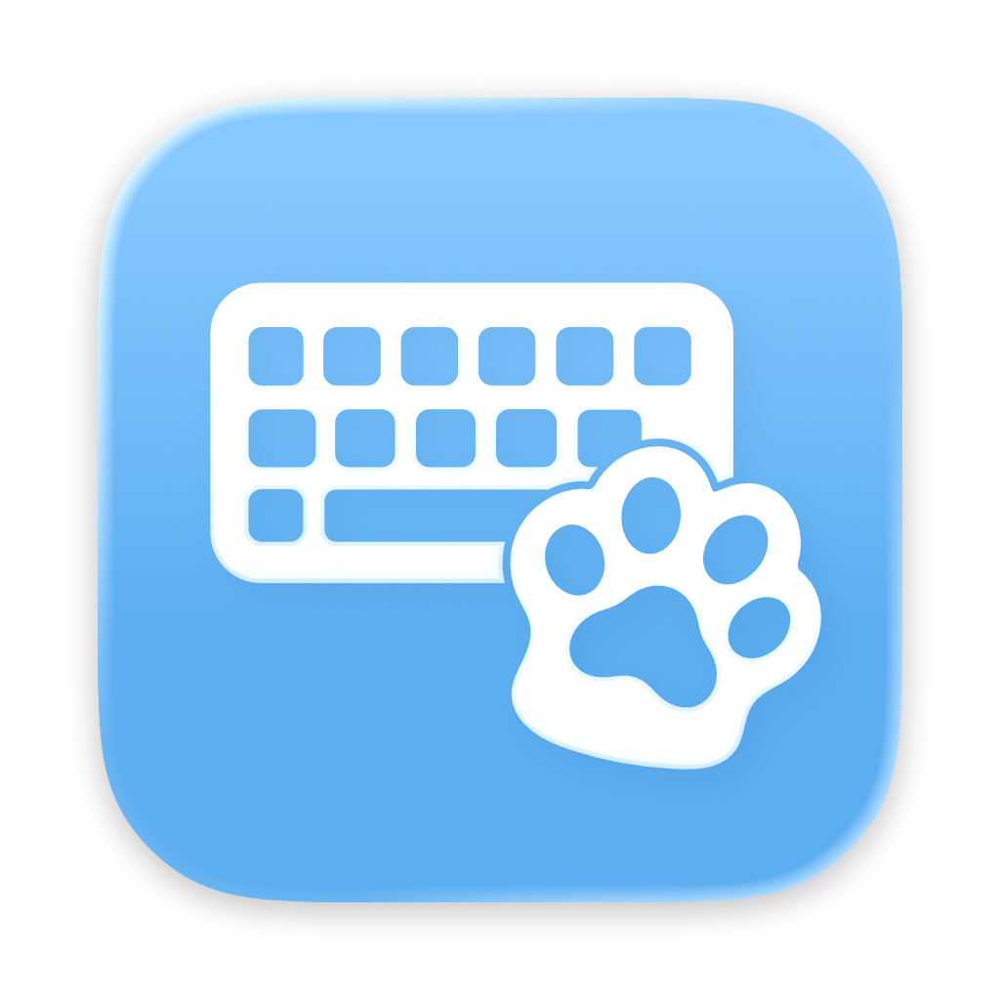

<br />
<div align="center">
  

  <h3 align="center">KeyPet</h3>

  <p align="center">
    轻量化、低资源占用的 macOS 原生键盘桌宠应用
    <br />
    <br />
    <a href="README.md">简体中文</a>
    &middot;
    <a href="README.en.md">English</a>
    &middot;
    <a href="README.ja.md">日本語</a>
  </p>
</div>

## 简介

KeyPet 是一款桌面宠物应用，只要按条件配置好对应的 PNG/APNG 角色资源，它就会让桌宠角色在敲击键盘时作出对应的反馈，还可以让它向上方有弹性地晃动。

这款桌宠应用专为搭载 Apple 芯片的 Mac 而生，通过 Swift 6 语言构建，并使用 Core Animation 作为渲染与计时基座，架构设计以性能优化为第一优先级。因此相较于其他跨平台的桌宠项目，KeyPet 能以更少的资源占用，实现同样流畅的 60FPS 动画效果。

KeyPet 支持丰富的动画触发方式，可以根据你敲击的键盘方位（左侧/右侧）进行触发，也支持为特定按键设置专用的动作图片。

此外还可以让角色水平翻转，或是交换左右肢体的响应方式，为其添加实时阴影；并可调节大小、不透明度，以及肢体动画的复位时间。

**⚠️注意：** **KeyPet 不提供桌宠资源。** 您需要自行设计并制作，或从正式渠道下载宠物素材。

## 系统要求

- 搭载 Apple 芯片（arm64）的 Mac，支持 macOS 15.0 或更高版本。

不支持 Intel 芯片的 Mac。

## 安装

1. 从 **Release** 页面的 **Assets** 中，下载最新版本的 `.dmg` 安装镜像。
2. 双击 `.dmg` 安装镜像，将 **KeyPet.app** 拖入 **Applications（应用程序）** 文件夹。

## 首次运行

请按照提示，在 **系统设置 - 隐私与安全性 - 输入监控** 中启用 **KeyPet**，若列表中没有 KeyPet，请点击列表下方的 + 号添加。

启用完毕后，请允许系统重新打开 KeyPet，并选择存放宠物素材的文件夹。这一设置之后可通过菜单调整。

## 关于「输入监控」

由于 KeyPet 不会在前台抢占键盘焦点，它感知键盘输入的唯一途径，是通过 macOS 的 Core Graphics API 全局监听键盘事件，因此需要您授予其「输入监控」权限。

请放心，**KeyPet 没有任何联网、分析或遥测功能，更不会将键盘输入的信息储存或传输。 ** 欢迎您通过源代码持续验证这一事实。

## 准备宠物素材

### 基本要求

- 静态 PNG（`.png`）或动态 PNG（`.apng`）格式的图片文件
- 图片宽、高均不得超过 2048px
- 单文件大小不得超过 64MiB
- 动画文件最大帧数为 2000 帧

### 文件夹格式

KeyPet 通过素材根目录下的子文件夹区分不同的宠物。具体格式可参照下方的文件树：

```text
MyPets/
└── Swordsman43/
    ├── pet-idle.png
    ├── pet-left.png
    ├── pet-right.png
    └── pet-space.png
```

子文件夹的名称会被视作宠物的名称，显示在菜单中，如这里的 `Swordsman43` 。

### 文件命名规则

#### 基础信息

一个文件被视为一种角色动作，文件名则决定了这个动作会因按下了哪个按键而响应触发。

文件名格式如下：
```text
pet-<token>.png  或  pet-<token>.apng
```

其中 `pet-idle` 代表待机时显示的角色，**必须存在。**`pet-left` 与 `pet-right` 代表左/右肢体的动作，根据键盘的左右手归属，或左/右方向键 `←/→`、音量减/加键、上一曲/下一曲键触发。

**推荐一个桌宠角色至少包括  `pet-idle` 、`pet-left`  与  `pet-right` 。**

#### 按键 token 一览

**字母键**：token 即对应的小写字母，共 26 个（`a`、`b`、`c` … `x`、`y`、`z`）。

**数字行与标点**：

| 按键        | token          |
| ----------- | -------------- |
| 1           | `1`            |
| 2           | `2`            |
| 3           | `3`            |
| 4           | `4`            |
| 5           | `5`            |
| 6           | `6`            |
| 7           | `7`            |
| 8           | `8`            |
| 9           | `9`            |
| 0           | `0`            |
| -           | `minus`        |
| =           | `equals`       |
| [           | `openbracket`  |
| ]           | `closebracket` |
| ;           | `semicolon`    |
| '           | `quote`        |
| ,           | `comma`        |
| .           | `period`       |
| /           | `slash`        |
| `` ` ``     | `backquote`    |
| \（反斜杠） | `backslash`    |

**编辑键**：

| 按键           | token       |
| -------------- | ----------- |
| Return         | `enter`     |
| Tab            | `tab`       |
| 空格           | `space`     |
| 退格（Delete） | `backspace` |
| Esc            | `escape`    |
| Caps Lock      | `capslock`  |

**修饰键**：

| 按键       | token          |
| ---------- | -------------- |
| 左 Shift   | `shift`        |
| 右 Shift   | `rightshift`   |
| 左 Control | `control`      |
| 右 Control | `rightcontrol` |
| 左 Option  | `option`       |
| 右 Option  | `rightoption`  |
| 左 Command | `command`      |
| 右 Command | `rightcommand` |
| Fn         | `fn`           |

**功能键**：F1–F12 对应 `f1`–`f12`。

**导航与方向键**：

| 按键                | token      |
| ------------------- | ---------- |
| Home                | `home`     |
| End                 | `end`      |
| Page Up             | `pageup`   |
| Page Down           | `pagedown` |
| Forward Delete（⌦） | `delete`   |
| ↑                   | `up`       |
| ↓                   | `down`     |
| ←                   | `left`     |
| →                   | `right`    |

**小键盘**：

| 按键     | token               |
| -------- | ------------------- |
| 数字 0–9 | `numpad0`–`numpad9` |
| +        | `numpadplus`        |
| −        | `numpadminus`       |
| ×        | `numpadmultiply`    |
| ÷        | `numpaddivide`      |
| 小数点   | `numpaddecimal`     |
| =        | `numpadequals`      |
| Enter    | `numpadenter`       |
| Clear    | `numpadclear`       |

**媒体键**：

| 按键                        | token        |
| --------------------------- | ------------ |
| 播放 / 暂停（同一个媒体键） | `playpause`  |
| 上一曲                      | `previous`   |
| 下一曲                      | `next`       |
| 音量 +                      | `volumeup`   |
| 音量 −                      | `volumedown` |
| 静音                        | `mute`       |

具体的 token 匹配规则也可参见代码 [`PetKeyMapping.swift`](Sources/Input/PetKeyMapping.swift) 。

#### 动作匹配规则

每次按下按键时，KeyPet 会按以下顺序挑选动作：

1. **按键专属的 token**：如 `1` 、`a`、`space`、`enter` 等。
2. **左/右肢体**：没有专属图片的按键，按左/右归属，触发 `left` 或 `right`。
3. **待机图**：在没有 `left` 或 `right` 相关素材时，会显示 `idle`。

#### 素材加载

在启动时，KeyPet 会读取存放在素材根目录下的所有子文件夹，且 KeyPet 支持自动识别重新加载素材，替换或增删素材后无需重启应用。

如果出现无法正常识别到桌宠的情况，可在菜单中选择 **宠物 - 重新扫描**。

#### 示例宠物

您可以在[这里](demo)下载示例宠物的素材文件。

## 从源码构建

安装 Xcode 26 或更高版本（包含 Swift 6 和 Icon Composer 支持），并将其设为当前使用的开发工具目录。Release 构建已在 Xcode 27.0 下验证通过。

```sh
xcodebuild -project KeyPet.xcodeproj -scheme KeyPet \
  -configuration Release -destination 'generic/platform=macOS' \
  -derivedDataPath build/DerivedData build
```

构建产物位于 `build/DerivedData/Build/Products/Release/KeyPet.app`。

## 常见问题

1. **安装后无法直接双击启动：** 可在 **系统设置 - 隐私与安全性** 中向下滚动，然后点按 **仍要打开** 按钮。
2. **安装后双击启动，提示「已损坏，无法打开」**：可先尝试右键点击 KeyPet 应用图标，在菜单中选择 **打开**。若此方法无效，可尝试在终端中运行以下命令： `sudo xattr -r -d com.apple.quarantine /Applications/KeyPet.app` 。
3. **键盘上的 Fn 键无法触发角色动画**：一部分外接键盘上的 Fn 键，其逻辑可能完全由键盘内部的固件处理，不会向 macOS 系统发送按键事件。因此这一类 Fn 键无法被应用检测。但在系统默认设置下，按住 Fn + 功能键，依然可以正确触发 F1、F2 等功能键对应的动画。

## 许可证

KeyPet 基于 [MIT 许可证](LICENSE) 开源。

Copyright (c) 2026 Micromacer
